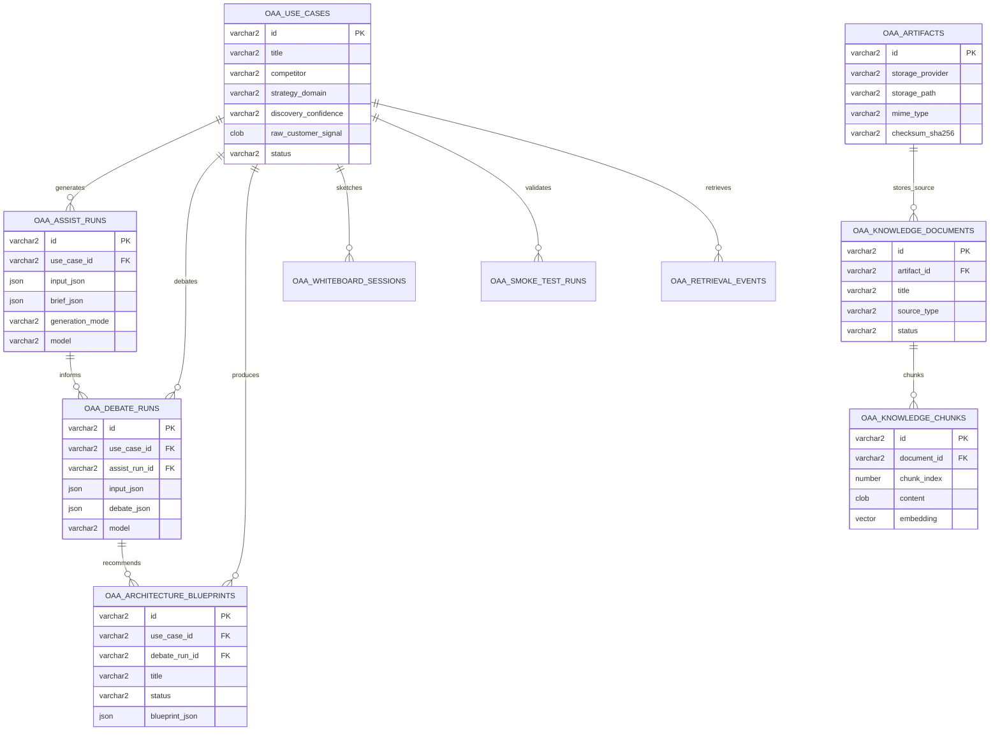

# Oracle Architecture Arena Data Model

Date: 2026-05-12
Branch: `codex/deployment-hardening`

This is the first practical data model for moving Oracle Architecture Arena from browser-local prototype storage into Autonomous Database.

The model assumes:

- Autonomous Database stores structured app state, generated JSON outputs, vector-search chunks, and retrieval history.
- The VM local filesystem stores temporary large artifacts such as uploads, screenshots, recordings, and exports.
- ADB stores metadata for those files so we can move from VM filesystem to OCI Object Storage later without redesigning the app.
- Authentication is not implemented yet, but nullable ownership fields are included for a future auth layer.

## Entity Overview



## Core Business Objects

### Use Case

Represents the customer scenario or pursuit. This is the durable catalog item the SE can return to later.

Maps today to:

- `UseCaseCatalogItem`
- Scenarios page
- Competitive SE Assistant context selector
- Debate Arena context selector
- Architecture Generator history seed

Important fields:

- `title`
- `account_name`
- `competitor`
- `strategy_domain`
- `discovery_confidence`
- `raw_customer_signal`
- `status`
- `tags_json`

### SE Assistant Run

Represents one generation of Competitive SE Assistant output for a use case.

Maps today to:

- `CompetitiveAssistGenerationResult`
- `CompetitiveAssistBrief`
- battle-card output
- Discovery Agent questions
- Oracle positioning guidance
- retrieved references shown in the UI

Store the full generated output in `brief_json`. Keep relational columns only for filtering and audit fields such as generation mode, model, warning, latency, and timestamp.

### Debate Run

Represents one Debate Arena generation for a use case.

Maps today to:

- `DebateArenaGenerationResult`
- `ArchitectureDebate`
- Oracle Architect Agent panel
- Competitor Architect Agent panel
- Neutral CTO Judge panel
- scorecard
- recommendation summary

Store the full generated debate in `debate_json`.

### Architecture Blueprint

Represents generated architecture history.

Maps today to:

- `ArchitectureGeneratorBlueprint`
- ReactFlow nodes and edges
- node status values: `Generated`, `Review`, `Validated`
- architecture recommendation integration from Debate Arena

Store the full blueprint in `blueprint_json`. Promote `title`, `status`, `confidence`, and `use_case_id` so the history dropdown can query quickly.

### Whiteboard Session

Represents tldraw canvas state and architecture notes.

Maps today to:

- Whiteboard Studio canvas
- architecture notes
- export package
- future sketch-to-architecture AI hook

The tldraw snapshot and notes are JSON. Exported SVG/JSON files should be stored as artifacts.

### Smoke Test Run

Represents a repeatable application test that can appear in the catalog.

Maps today to:

- Markdown smoke test files
- screenshot trails
- future screen recordings
- test findings and follow-ups

This keeps smoke tests visible in the app instead of living only in the repo.

## Artifact Storage Model

For the pilot, the VM filesystem can store non-tabular assets:

```text
/var/lib/oracle-architecture-arena/artifacts/
  knowledge/
  smoke-tests/
  whiteboards/
  briefs/
  architecture-blueprints/
```

ADB should store every file's metadata in `oaa_artifacts`.

Key idea: the app should not hard-code local paths into many business tables. Business tables reference `artifact_id` or store artifact keys in JSON. Later, the same `oaa_artifacts` table can point to OCI Object Storage by changing `storage_provider` from `LOCAL_FS` to `OCI_OBJECT_STORAGE`.

## RAG Knowledge Model

Knowledge documents are stored as file artifacts plus searchable database metadata.

Flow:

1. Store the source file on the VM filesystem.
2. Insert an `oaa_artifacts` row.
3. Insert an `oaa_knowledge_documents` row pointing to the artifact.
4. Extract and chunk text.
5. Generate embeddings.
6. Insert one row per chunk into `oaa_knowledge_chunks`.
7. Query chunks using ADB vector search.
8. Record which chunks were retrieved in `oaa_retrieval_events`.

The app already has a `RagReference[]` shape. Database retrieval should return that same shape so the UI does not need to be redesigned.

## Why JSON Is Used

LLM outputs evolve quickly. Storing generated output as JSON avoids creating dozens of brittle tables for every card, agent response, score, node, and recommendation.

Relational columns are still used for:

- catalog filtering
- history dropdowns
- ownership
- status
- model/audit metadata
- timestamps
- retrieval traceability

This gives us a practical balance: durable and queryable without over-modeling the prototype.

## First Implementation Slice

The first backend slice should be intentionally small:

1. Add ADB connection helper.
2. Add a database health route.
3. Run the initial schema migration.
4. Add use case list/create/read APIs.
5. Update Scenarios and Competitive SE Assistant to use the APIs.
6. Keep browser local storage as a fallback until the ADB path is proven.

After that:

1. Persist SE Assistant runs.
2. Persist Debate Arena runs.
3. Persist Architecture Generator blueprints.
4. Persist smoke tests.
5. Add artifact metadata.
6. Add RAG ingestion and vector retrieval.

## Initial Migration

The first SQL migration is here:

`db/migrations/001_initial_adb_schema.sql`

It assumes an Autonomous Database version that supports native `JSON` and `VECTOR` columns. If your ADB instance does not support native JSON columns, we can adapt JSON fields to `CLOB CHECK (column IS JSON)`.
