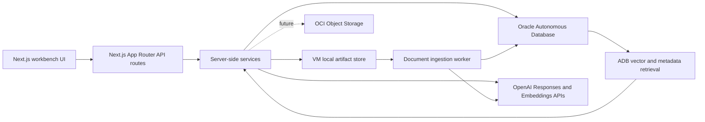

# Persistence and RAG Design

Date: 2026-05-12
Branch: `codex/deployment-hardening`
Scope: Autonomous Database persistence, VM filesystem artifact storage for the pilot, future Object Storage migration, and future RAG search for Oracle Architecture Arena.

## Current App State

The app is ready for a first persistence layer, but most catalog state is still browser-local or seeded from source files.

- Use cases are saved in browser `localStorage` through `src/lib/use-case-catalog.ts`.
- Competitive SE Assistant and Debate Arena generation happen through Next.js API routes.
- RAG context is a local TypeScript corpus in `src/data/rag-corpus.ts`.
- Architecture history is seeded in the Architecture Generator page.
- Whiteboard Studio uses tldraw browser persistence and can export artifacts from the client.
- Smoke tests are stored as Markdown plus screenshots under `docs/smoke-tests`.

The first backend move should replace browser-local catalog state with Autonomous Database while keeping the UI workflow unchanged.

## Target Architecture



Primary responsibilities:

- Autonomous Database is the system of record for use cases, generated SE Assistant outputs, Debate Arena runs, architecture blueprints, whiteboard metadata, smoke test runs, artifact metadata, and RAG chunks.
- VM local filesystem is the pilot artifact store for source knowledge documents, uploaded artifacts, smoke-test recordings, screenshots, whiteboard exports, and generated briefs.
- OCI Object Storage remains the recommended long-term artifact store once backup, retention, and team access requirements firm up.
- OpenAI remains the generation layer for SE Assistant and Debate Arena.
- OpenAI embeddings can power the first vector-search implementation. The schema should leave room to switch or add OCI Generative AI embeddings later.

## Design Principles

- Preserve generated artifacts as JSON so the app can evolve without constant table churn.
- Promote important filter fields into relational columns for fast catalog views.
- Store source documents in the artifact store, not directly in database rows. For the pilot this is the VM filesystem; later it can be OCI Object Storage.
- Store chunks, metadata, and vectors in Autonomous Database for retrieval.
- Keep all OpenAI and Oracle credentials server-side only.
- Do not add authentication yet, but include nullable ownership fields so auth can be added without a schema rewrite.
- Keep seeded smoke tests and mock data as bootstrap content, not as the long-term persistence layer.

## Autonomous Database Model

Use an application schema, not the `ADMIN` database user. The schema can start with UUID-like string identifiers to match the current TypeScript contracts.

If the target ADB is Oracle Database 23ai or newer, use native `JSON` and `VECTOR` columns. If the target service level does not support native `JSON`, use `CLOB CHECK (column IS JSON)` for JSON payloads.

### Core Tables

```sql
create table oaa_use_cases (
  id varchar2(64) primary key,
  title varchar2(240) not null,
  account_name varchar2(240),
  competitor varchar2(40) not null,
  strategy_domain varchar2(40) not null,
  discovery_confidence varchar2(20) not null,
  raw_customer_signal clob not null,
  status varchar2(30) default 'active' not null,
  source_type varchar2(30) default 'user' not null,
  tags_json json,
  owner_id varchar2(128),
  created_at timestamp with time zone default systimestamp not null,
  updated_at timestamp with time zone default systimestamp not null
);

create table oaa_assist_runs (
  id varchar2(64) primary key,
  use_case_id varchar2(64) not null references oaa_use_cases(id),
  input_json json not null,
  brief_json json not null,
  generation_mode varchar2(20) not null,
  model varchar2(80),
  warning varchar2(1000),
  rag_context_json json,
  latency_ms number,
  created_at timestamp with time zone default systimestamp not null
);

create table oaa_debate_runs (
  id varchar2(64) primary key,
  use_case_id varchar2(64) not null references oaa_use_cases(id),
  assist_run_id varchar2(64) references oaa_assist_runs(id),
  input_json json not null,
  debate_json json not null,
  generation_mode varchar2(20) not null,
  model varchar2(80),
  reasoning_effort varchar2(30),
  rag_context_json json,
  latency_ms number,
  created_at timestamp with time zone default systimestamp not null
);

create table oaa_architecture_blueprints (
  id varchar2(64) primary key,
  use_case_id varchar2(64) not null references oaa_use_cases(id),
  debate_run_id varchar2(64) references oaa_debate_runs(id),
  title varchar2(240) not null,
  summary clob,
  status varchar2(30) default 'generated' not null,
  confidence number(5, 2),
  blueprint_json json not null,
  created_at timestamp with time zone default systimestamp not null,
  updated_at timestamp with time zone default systimestamp not null
);

create table oaa_whiteboard_sessions (
  id varchar2(64) primary key,
  use_case_id varchar2(64) references oaa_use_cases(id),
  title varchar2(240) not null,
  tldraw_snapshot_json json,
  notes_json json,
  export_object_key varchar2(1024),
  created_at timestamp with time zone default systimestamp not null,
  updated_at timestamp with time zone default systimestamp not null
);

create table oaa_smoke_test_runs (
  id varchar2(64) primary key,
  use_case_id varchar2(64) references oaa_use_cases(id),
  title varchar2(240) not null,
  status varchar2(30) not null,
  scenario_json json not null,
  steps_json json,
  findings_json json,
  artifact_prefix varchar2(1024),
  started_at timestamp with time zone,
  completed_at timestamp with time zone,
  created_at timestamp with time zone default systimestamp not null
);
```

### Knowledge And Retrieval Tables

```sql
create table oaa_knowledge_documents (
  id varchar2(64) primary key,
  title varchar2(300) not null,
  source_type varchar2(40) not null,
  strategy_domain varchar2(40),
  competitor varchar2(40),
  object_bucket varchar2(128) not null,
  object_key varchar2(1024) not null,
  object_version varchar2(200),
  content_hash varchar2(128),
  mime_type varchar2(120),
  classification varchar2(40) default 'internal' not null,
  status varchar2(30) default 'active' not null,
  metadata_json json,
  created_at timestamp with time zone default systimestamp not null,
  updated_at timestamp with time zone default systimestamp not null
);

create table oaa_knowledge_chunks (
  id varchar2(64) primary key,
  document_id varchar2(64) not null references oaa_knowledge_documents(id),
  chunk_index number not null,
  heading varchar2(500),
  content clob not null,
  token_count number,
  embedding_model varchar2(80) not null,
  embedding vector(3072, float32),
  metadata_json json,
  created_at timestamp with time zone default systimestamp not null
);

create table oaa_retrieval_events (
  id varchar2(64) primary key,
  use_case_id varchar2(64) references oaa_use_cases(id),
  run_type varchar2(40) not null,
  run_id varchar2(64),
  query_text clob not null,
  embedding_model varchar2(80),
  filters_json json,
  results_json json,
  created_at timestamp with time zone default systimestamp not null
);
```

For `text-embedding-3-large`, use a 3072-dimension vector column. If we choose `text-embedding-3-small` or configure smaller dimensions, this column size should be adjusted before production data is loaded.

### Retrieval Query Shape

```sql
select
  c.id,
  d.title,
  d.source_type,
  c.heading,
  c.content,
  vector_distance(c.embedding, :query_embedding, cosine) as distance
from oaa_knowledge_chunks c
join oaa_knowledge_documents d
  on d.id = c.document_id
where d.status = 'active'
  and (d.strategy_domain = :strategy_domain or d.strategy_domain is null)
  and (d.competitor = :competitor or d.competitor is null)
order by distance
fetch first :limit rows only;
```

The retrieval service should return the same `RagReference[]` shape the UI already understands, plus internal IDs for traceability.

## Artifact Storage Layout

For the pilot, use a private VM directory outside the repo:

```text
/var/lib/oracle-architecture-arena/artifacts/
  knowledge/
  smoke-tests/
  whiteboards/
  briefs/
  architecture-blueprints/
```

ADB should store artifact metadata and file paths in `oaa_artifacts`. This keeps the app portable when the artifact store moves to Object Storage later.

When moving to Object Storage, use private buckets. For public-sector and sovereign conversations, assume no public bucket access.

Recommended buckets or prefixes:

```text
oaa-knowledge/
  raw/{domain}/{documentId}/{originalFilename}
  extracted/{documentId}/text.json
  processed/{documentId}/chunks.json

oaa-artifacts/
  smoke-tests/{smokeTestRunId}/screenshots/
  smoke-tests/{smokeTestRunId}/recordings/
  whiteboards/{whiteboardSessionId}/exports/
  briefs/{useCaseId}/
  architecture-blueprints/{blueprintId}/
```

Object Storage should hold source files and large binary artifacts. ADB should hold metadata, search chunks, generated JSON, and links back to object keys.

## RAG Ingestion Flow

1. Upload a source document into `oaa-knowledge/raw/...`.
2. Create or update an `oaa_knowledge_documents` row with title, domain, competitor, classification, object key, MIME type, and hash.
3. Extract text from the source file.
4. Chunk text by heading-aware sections, targeting roughly 500 to 1000 tokens with overlap.
5. Generate embeddings for each chunk.
6. Insert chunks and vectors into `oaa_knowledge_chunks`.
7. Mark the document `active` only after extraction, chunking, and embedding complete.
8. During SE Assistant or Debate Arena generation, embed the customer context and query ADB for top references.
9. Persist the retrieval event so every generated output can explain which references were used.

## API Evolution

Keep the current page routes, but move state behind server APIs.

First backend endpoints:

- `GET /api/use-cases`
- `POST /api/use-cases`
- `GET /api/use-cases/:id`
- `PATCH /api/use-cases/:id`
- `POST /api/use-cases/:id/assist-runs`
- `POST /api/use-cases/:id/debate-runs`
- `GET /api/use-cases/:id/architecture-blueprints`
- `POST /api/use-cases/:id/architecture-blueprints`
- `GET /api/knowledge-documents`
- `POST /api/knowledge-documents`
- `POST /api/knowledge-documents/:id/ingest`
- `GET /api/smoke-test-runs`
- `POST /api/smoke-test-runs`

The current `/api/competitive-assist` and `/api/debate-arena` routes can remain as generation endpoints, but the implementation should add optional persistence when a `useCaseId` is provided.

## Environment Variables

Application:

```env
NEXT_DEPLOYMENT_ID=
HOSTNAME=0.0.0.0
PORT=3000
```

OpenAI:

```env
OPENAI_API_KEY=
OPENAI_MODEL=
OPENAI_DEBATE_MODEL=
OPENAI_DEBATE_REASONING_EFFORT=
OPENAI_EMBEDDING_MODEL=text-embedding-3-large
```

Autonomous Database:

```env
ORACLE_DB_USER=
ORACLE_DB_PASSWORD=
ORACLE_DB_CONNECT_STRING=
ORACLE_DB_WALLET_LOCATION=
ORACLE_DB_WALLET_PASSWORD=
ORACLE_DB_POOL_MIN=1
ORACLE_DB_POOL_MAX=4
ORACLE_DB_POOL_INCREMENT=1
```

OCI Object Storage:

```env
OCI_REGION=
OCI_TENANCY_OCID=
OCI_COMPARTMENT_OCID=
OCI_OBJECT_NAMESPACE=
OCI_KNOWLEDGE_BUCKET=
OCI_ARTIFACT_BUCKET=
```

On the OCI VM, prefer instance principals for Object Storage access. For local development, use an OCI config profile or temporary local credentials outside git.

## Node.js Database Integration

Use `node-oracledb` Thin mode first because it avoids Oracle Client installation on the VM. Add Thick mode only if a required feature needs it.

Suggested code layout:

```text
src/lib/db/
  oracle.ts              pooled connection helper
  use-cases.ts           use case repository
  generation-runs.ts     assist and debate persistence
  knowledge.ts           document and chunk repository
  smoke-tests.ts         smoke test repository

src/lib/rag/
  search.ts              ADB vector retrieval
  embeddings.ts          OpenAI embedding client
  ingest.ts              document chunking and indexing
```

In Next.js, keep all Oracle code in server-only modules used by API routes. Do not import database modules from client components.

## Security And Governance

- Keep `.env.local` ignored.
- Never expose database or OpenAI values with `NEXT_PUBLIC_`.
- Store Object Storage buckets as private.
- Use object versioning for knowledge documents and smoke-test evidence.
- Add retention policies for smoke recordings and exported briefs once the team decides retention rules.
- Persist model name, reasoning effort, retrieval references, and warning state for every generated artifact.
- Store generated outputs even when OpenAI falls back to local generation, because field users still need catalog continuity.
- Add auth later, but reserve `owner_id`, workspace, and role fields now.

## Migration From Current Prototype

1. Seed `src/data/rag-corpus.ts` into `oaa_knowledge_documents` and `oaa_knowledge_chunks` as bootstrap references.
2. Seed the smoke-test use case from `src/data/smoke-test-fixtures.ts`.
3. Replace `readUseCaseCatalog` and `saveUseCaseToCatalog` with API-backed calls.
4. Keep the browser-local catalog as a development-only fallback until ADB is configured.
5. Add an export/import helper if we need to recover local browser-created use cases before the database cutover.

## Implementation Sequence

1. Add `oracledb` and a server-only connection pool helper.
2. Add a database health route that verifies ADB connectivity without exposing credentials.
3. Add migration SQL under `db/migrations`.
4. Add use case catalog APIs and wire Scenarios to ADB.
5. Persist Competitive SE Assistant generation runs.
6. Persist Debate Arena generation runs and scoring outputs.
7. Persist Architecture Generator blueprint history.
8. Persist smoke-test runs and screenshot/recording object keys.
9. Add Object Storage document metadata APIs.
10. Add ingestion script or worker for text extraction, chunking, embeddings, and vector insert.
11. Replace local `searchRagContext` with ADB vector retrieval.

## Open Decisions

- Confirm the exact ADB version and whether native `JSON` and `VECTOR` are available.
- Confirm whether the VM can use one-way TLS to ADB or must use an mTLS wallet.
- Choose the first embedding model and vector dimension before loading production documents.
- Decide whether knowledge documents will be uploaded through the app UI, an admin script, or OCI Console first.
- Decide smoke-test video storage format and retention period.
- Decide when to add authentication and workspace separation.

## References

- Oracle AI Vector Search overview: https://docs.oracle.com/en/database/oracle/oracle-database/26/vecse/overview-ai-vector-search.html
- Oracle `VECTOR_DISTANCE`: https://docs.oracle.com/en/database/oracle/oracle-database/23/sqlrf/vector_distance.html
- OCI Object Storage buckets: https://docs.oracle.com/en-us/iaas/Content/Object/Tasks/managingbuckets.htm
- OCI Object Storage objects: https://docs.oracle.com/en-us/iaas/Content/Object/Tasks/managingobjects.htm
- node-oracledb connection handling: https://node-oracledb.readthedocs.io/en/latest/user_guide/connection_handling.html
- OpenAI embeddings API reference: https://developers.openai.com/api/reference/resources/embeddings
