# Deep Smoke Test: AWS + Databricks V1

Date: 2026-05-11
Environment: local Next.js dev server at `http://localhost:3000`
Recording: screenshot trail in `docs/smoke-tests/deep-smoke-aws-databricks-v1-assets`

## Purpose

Exercise Oracle Architecture Arena as an enterprise field workflow, moving from executive dashboard to Competitive SE Assist, Scenarios catalog, Debate Arena, Architecture Generator, and Whiteboard Studio.

This run intentionally used a more complex customer scenario with AWS Cloud, Databricks, Tableau, Looker, Oracle 19c, Exadata, public-sector governance, conversational analytics, AI search, and modernization tradeoffs.

## Test Use Case

A national transportation and tolling authority is trying to modernize its analytics estate after years of department-by-department reporting. The data engineering team has built an AWS S3 data lake and is piloting Databricks on AWS for streaming toll transactions, connected vehicle telemetry, road maintenance logs, and ML-driven congestion forecasting.

Finance and operations executives still rely on Tableau dashboards for budget, toll revenue, and capital project reporting, while a digital services team is pushing Looker for self-service analytics over customer service, mobile app, and web journey data.

The authority runs Oracle 19c on Exadata for toll billing, payments, permitting, asset management, procurement, and financial systems of record. Those Oracle workloads must stay authoritative because of payment integrity, audit controls, performance, and public-sector retention requirements.

The CIO wants to know whether they should standardize on AWS plus Databricks as the enterprise lakehouse and use Tableau/Looker on top, or whether Oracle can provide a governed modernization path that reduces data duplication, keeps operational records trusted, supports AI search over project and maintenance documents, and gives business users conversational analytics without losing Oracle security and lineage.

## Overall Result

Result: passed with follow-up findings.

The app rendered each major workbench page, generated live Competitive SE Assist output, saved the generated use case into the Scenarios catalog, generated a live Debate Arena result, rendered the ReactFlow architecture workbench, and loaded the tldraw Whiteboard Studio.

Browser console errors observed during the final check: `0`.

## Test Steps And Results

### 1. Dashboard

Steps:

1. Open `http://localhost:3000/`.
2. Verify dashboard loads without the removed dashboard clutter.
3. Verify navigation order emphasizes Competitive SE Assist before Scenarios.
4. Verify primary workflow links and export control are present.

Checks:

- Dashboard loaded.
- Sidebar/top navigation included Dashboard, Competitive SE Assist, Debate Arena, Scenarios, Architecture Generator, and Whiteboard Studio.
- `Usable today`, `Current outputs`, and the old bottom domain boxes were not present.
- `Export brief` was present.
- New scenario / start assist entry point was present.
- Scenario catalog link was present.

Screens:

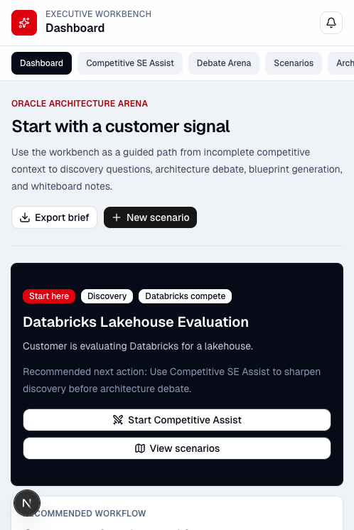

Note: the Codex in-app browser does not support download events, so the dashboard export control was verified as present but the actual file download should be checked once in a normal browser.

### 2. Competitive SE Assist

Steps:

1. Open Competitive SE Assist with the AWS/Databricks transportation use case.
2. Set competitor to Databricks.
3. Set strategy domain to lakehouse modernization.
4. Generate the field assist.
5. Verify output is saved into the use case catalog.

Checks:

- Customer context loaded correctly.
- Competitor was Databricks.
- Domain was lakehouse modernization.
- Discovery confidence was Directional.
- `SE Assistant` and `Discovery Agent` terminology was visible.
- Generation completed.
- Saved generated use case appeared in the catalog.
- Battle Card Output rendered.
- Discovery questions rendered.
- Oracle positioning rendered.
- Databricks, AWS, and Tableau/Looker context appeared in generated output.
- No `Local fallback` section was present.

Screens:

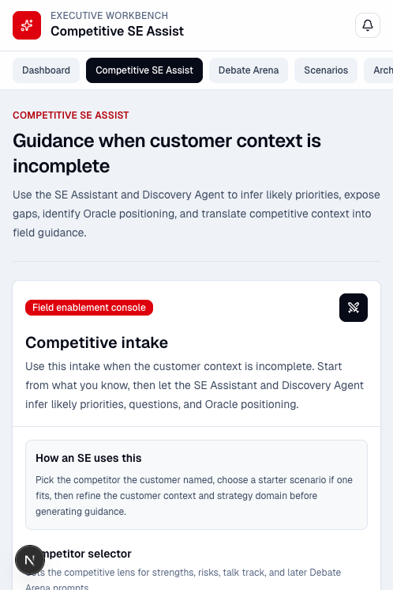
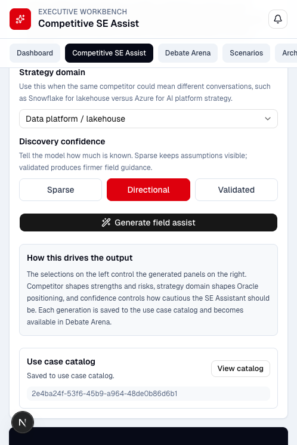

Note: long-field typing through the in-app browser hit a browser automation limitation, so this run used the app's template-prefill URL path. That tests the same page state and generation path, but manual text entry should remain part of human QA.

### 3. Scenarios Catalog

Steps:

1. Open `/scenarios`.
2. Verify the generated transportation/tolling use case is present.
3. Verify readiness information is use-case specific.
4. Scroll to editable pursuit templates.
5. Verify hover explanations exist for Questions, Positions, and RAG refs.

Checks:

- Saved generated use cases section rendered.
- The AWS/Databricks transportation use case was present.
- Databricks and AWS context appeared in the catalog.
- Scenario readiness rendered dynamically.
- Readiness labels included Discovery depth, Positioning clarity, and Retrieval coverage.
- Editable pursuit templates rendered.
- Reset templates control rendered.
- Start-assist links rendered.
- Tooltip/help text existed for Questions, Positions, and RAG refs.

Screens:

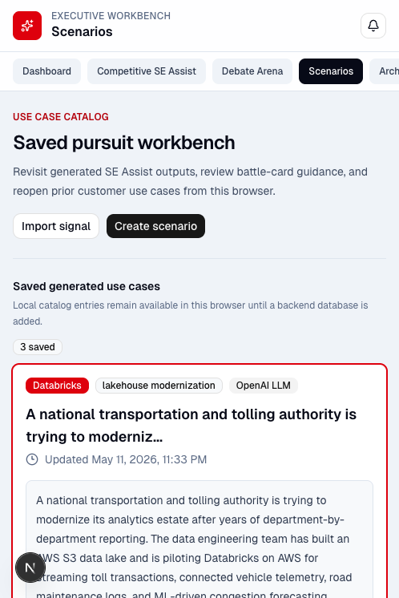
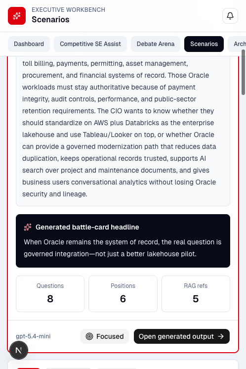

### 4. Debate Arena

Steps:

1. Open `/debate-arena`.
2. Verify the saved use case context is selectable.
3. Verify competitor selector is visible.
4. Verify the old static/mock response language is gone.
5. Generate a debate using the saved AWS/Databricks use case.
6. Verify the three-agent debate output and scoring system.

Checks:

- Use case context selector rendered.
- Competitor selector rendered.
- Generate debate button rendered.
- Static `Mock AI responses` language was not present.
- Oracle Architect Agent rendered.
- Competitor Architect Agent rendered.
- Neutral CTO Judge / Executive Architecture Arbiter rendered.
- Scoring system rendered.
- Architecture recommendation summary rendered.
- Generated output mentioned Databricks, AWS, and Oracle systems of record.
- No rate-limit error appeared.

Screens:

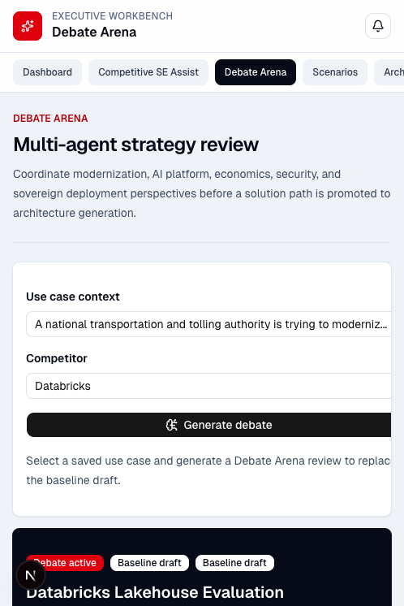

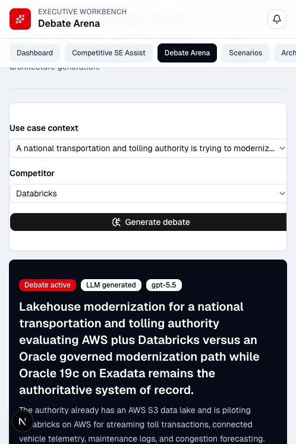

### 5. Architecture Generator

Steps:

1. Open `/architecture-generator`.
2. Verify ReactFlow architecture renders.
3. Verify OCI-style cards render.
4. Verify architecture summary renders.
5. Select the OCI AI Services card.
6. Verify editable detail fields remain visible.

Checks:

- Architecture Generator loaded.
- ReactFlow diagram and minimap rendered.
- OCI Data Lake, Autonomous Database, OCI AI Services, OCI Governance, and Architecture Center cards rendered.
- Architecture summary rendered.
- Debate recommendation integration label rendered.
- Editable fields were visible for OCI service card, architecture layer, and recommendation rationale.
- Selecting OCI AI Services updated the selected-node detail area.

Screens:

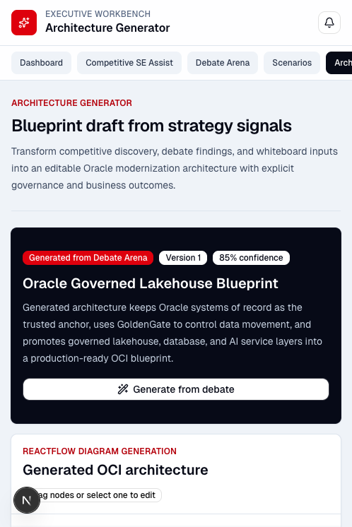
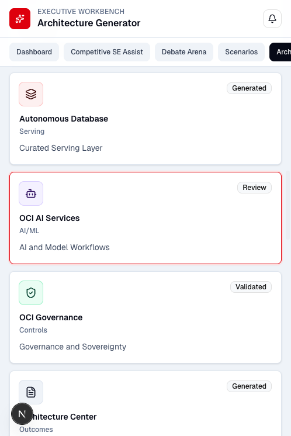

### 6. Whiteboard Studio

Steps:

1. Open `/whiteboard-studio`.
2. Verify tldraw canvas loads.
3. Verify architecture note-taking controls render.
4. Verify export controls render.
5. Click `Export package`.
6. Verify export status updates.

Checks:

- Whiteboard Studio loaded.
- tldraw sketch canvas rendered.
- Architecture notes and note capture controls rendered.
- `Export SVG` and `Export package` rendered.
- Sketch-to-architecture AI generation hook rendered.
- Export status changed after clicking `Export package`.

Screens:

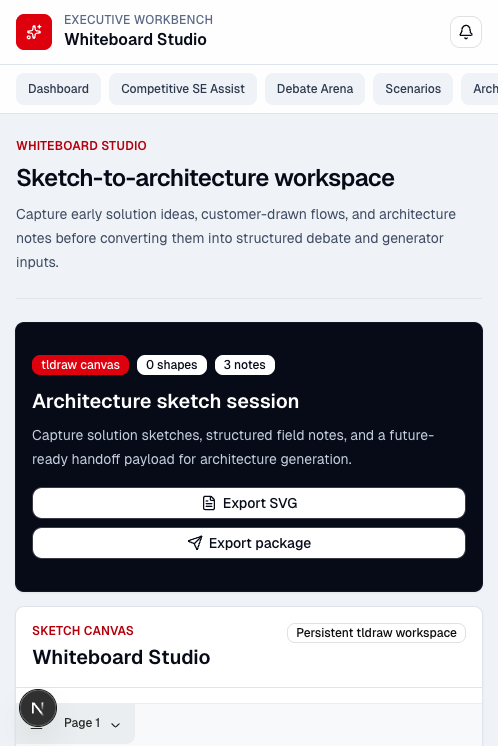
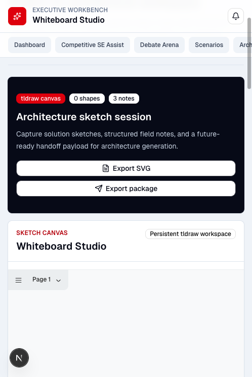

## Repeatable Harness

Use this sequence for the next smoke test:

1. Start the local app with `npm run dev`.
2. Open `http://localhost:3000/`.
3. Verify Dashboard navigation and action controls.
4. Open Competitive SE Assist with a fresh customer use case.
5. Generate field assist and confirm it saves into Scenarios.
6. Open Scenarios and verify the generated use case is reusable.
7. Open Debate Arena, select the saved use case, choose a competitor, and generate debate output.
8. Open Architecture Generator and verify the debate recommendation is reflected in the blueprint.
9. Open Whiteboard Studio, add or inspect notes, and test export status.
10. Capture screenshots for each page and update the follow-up log with any gaps.

## Follow-Up Log

Follow-up findings from this run are tracked in `docs/smoke-tests/deep-smoke-aws-databricks-v1-followups.md`.
