# Initial Test V2

Date: 2026-05-11
Environment: local Next.js dev server at `http://localhost:3000`
Recording: screenshot trail in `docs/smoke-tests/initial-test-v2-assets`

## Customer Use Case

A state government agency is modernizing its enterprise data warehouse and is evaluating Snowflake as the centralized analytics platform for cross-department reporting and AI-driven insights. Business users want conversational analytics for natural language questions such as budget variance trends by county and procurement spending anomalies. The agency already runs mission-critical Oracle 19c databases on Exadata on-premises for finance, HR, and permitting systems, and those systems will remain systems of record because of performance, security, and regulatory requirements. The customer wants guidance on Snowflake and AI capabilities versus what they can do with existing Oracle investments.

## Result

Overall result: smoke test passed for navigation, rendering, OpenAI-backed SE Assist generation, architecture interaction, and whiteboard export.

Notable improvement from v1: OpenAI generation succeeded. Competitive SE Assist showed `OpenAI LLM` instead of falling back to the local engine.

Remaining product gaps:

- Scenarios page buttons render, but `Create scenario` and `Open scenario` still have no visible action.
- Debate Arena still uses the static Databricks scenario and does not yet consume the live SE Assist output.
- Architecture Generator still uses the static governed lakehouse blueprint and does not yet consume the live Debate Arena output.
- Dashboard `Export brief` still needs manual validation in a normal browser because Codex in-app browser cannot observe downloads.

## Screens Recorded

1. Dashboard
   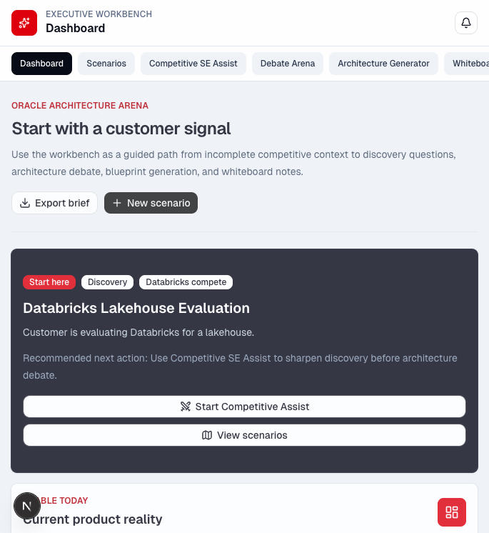

2. Competitive SE Assist entry page
   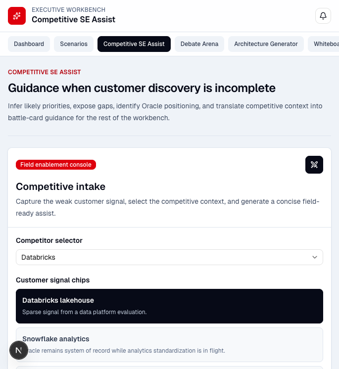

3. Customer use case entered into SE Assist
   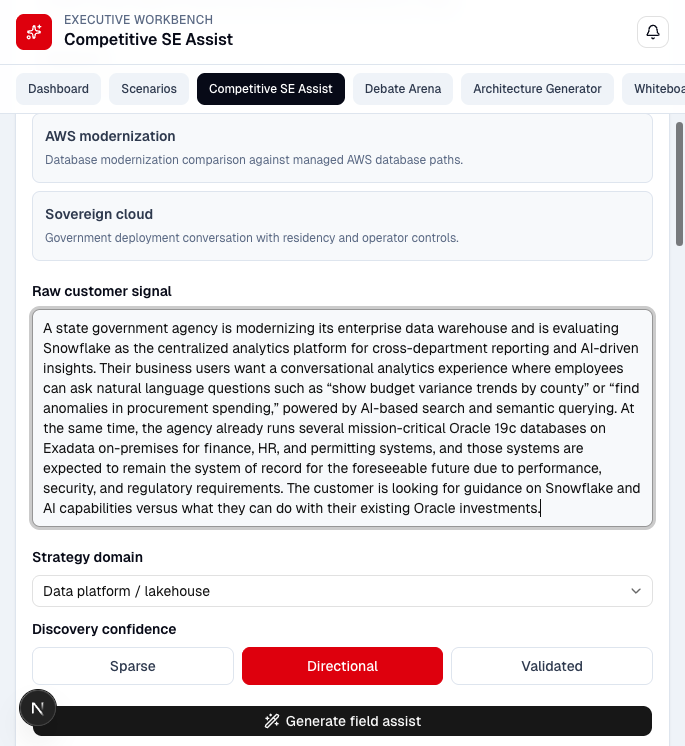

4. OpenAI-generated SE Assist result
   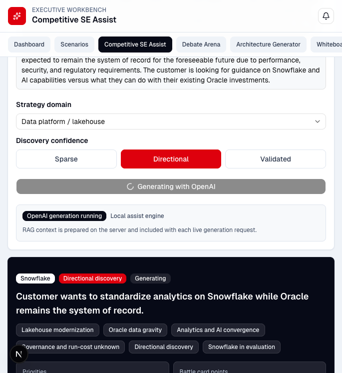

5. SE Assist battle-card and lower panels
   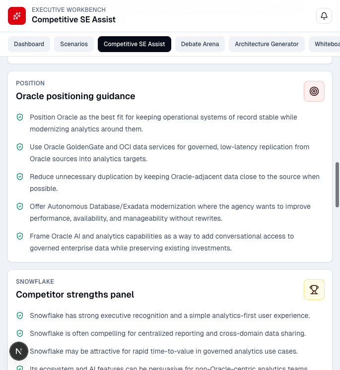

6. Scenarios page
   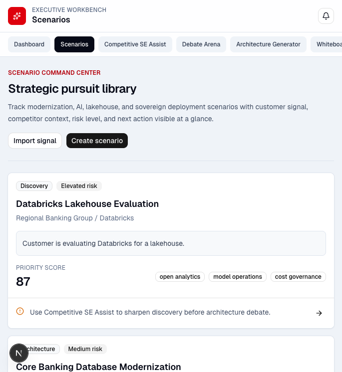

7. Debate Arena
   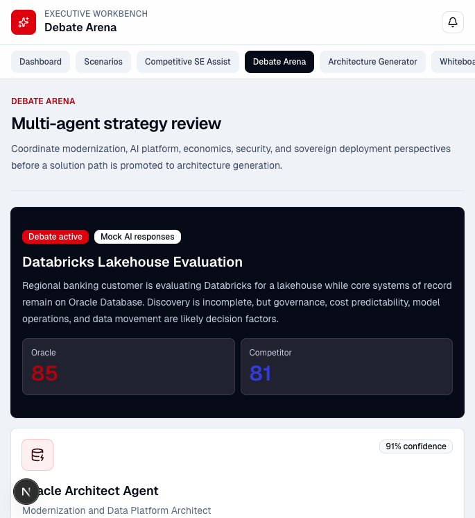

8. Architecture Generator
   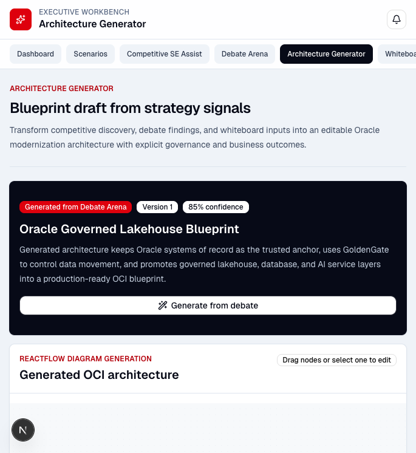

9. Architecture Generator node selected
   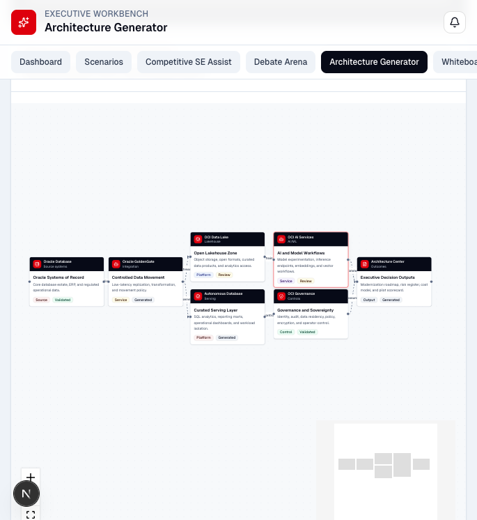

10. Whiteboard Studio
    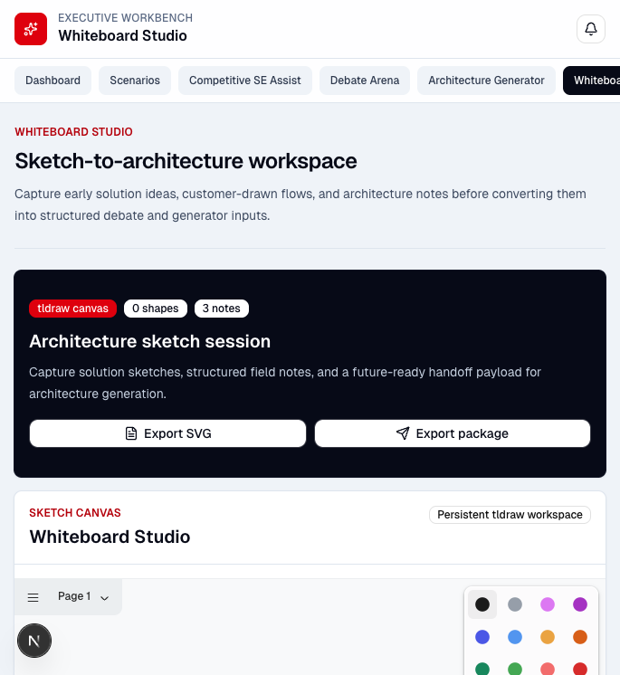

11. Whiteboard export result
    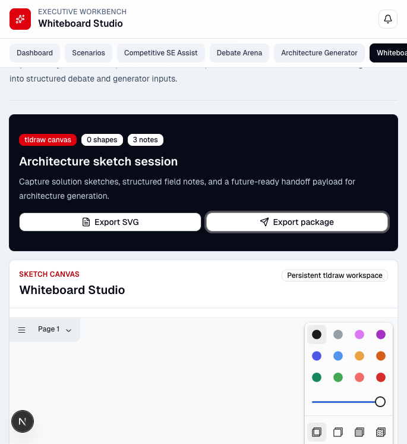

## Functional Checks

### Dashboard

- Page loaded.
- `New scenario` routed to Competitive SE Assist.
- `Export brief` was not retested because download handling is unsupported in the Codex in-app browser.

### Competitive SE Assist

- Snowflake context selected.
- Full state government Snowflake / Oracle Exadata use case entered.
- `Generate field assist` completed through OpenAI.
- UI displayed `OpenAI LLM`.
- Discovery questions, Oracle positioning, competitor strengths, recommended talk track, battle card output, and RAG context rendered.

### Scenarios

- Page loaded.
- Scenario cards rendered.
- `Create scenario` button present but produced no visible action.
- Four `Open scenario` buttons present; first button produced no visible action.

### Debate Arena

- Page loaded.
- Oracle Architect Agent rendered.
- Competitor Architect Agent rendered.
- Neutral CTO Judge rendered.
- Judge-weighted scorecard rendered.
- Architecture recommendation rendered.
- Content remains static and is not yet linked to the live SE Assist result.

### Architecture Generator

- Page loaded.
- ReactFlow architecture rendered.
- OCI-style architecture cards rendered.
- Architecture summary rendered.
- Clicking the OCI AI Services card selected the node and exposed node detail.
- Content remains static and is not yet linked to Debate Arena.

### Whiteboard Studio

- Page loaded.
- tldraw canvas rendered.
- Architecture notes rendered.
- Sketch-to-architecture AI hook rendered.
- `Export package` worked and reported `Exported package with 3 notes`.

## Console Health

Browser console errors observed during the smoke test: `0`

## Recommended Next Build Step

Connect workflow state across the workbench:

1. Save the generated SE Assist result in shared client state or local persistence.
2. Allow Debate Arena to consume that result as the debate scenario.
3. Allow Architecture Generator to consume the Debate Arena recommendation.
4. Make `Create scenario` and `Open scenario` real workflow entry points.
